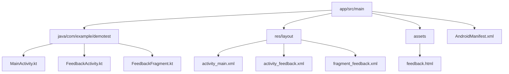
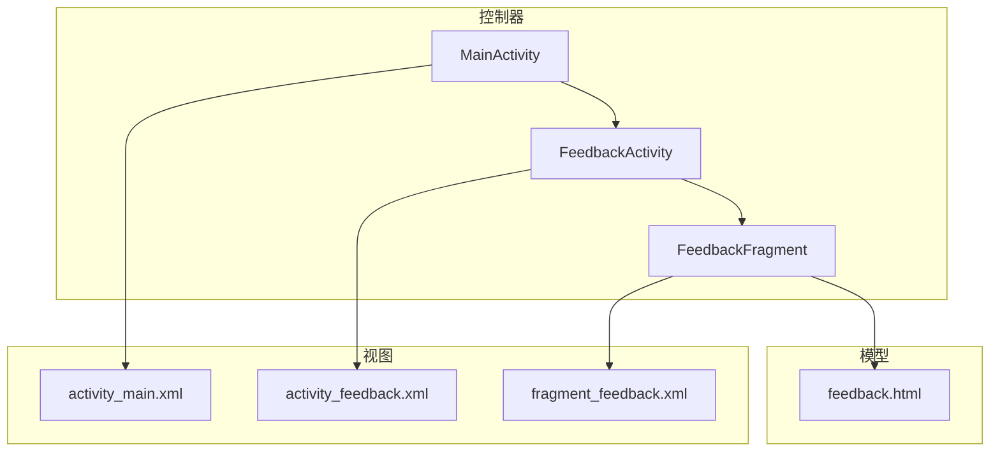
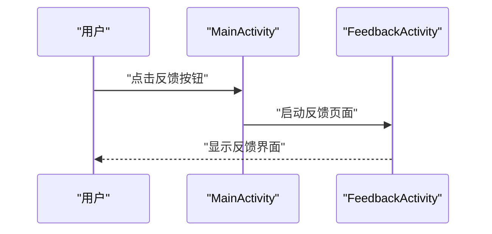
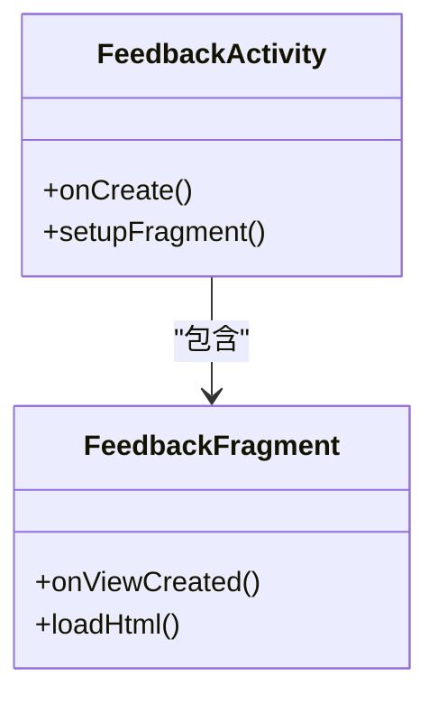
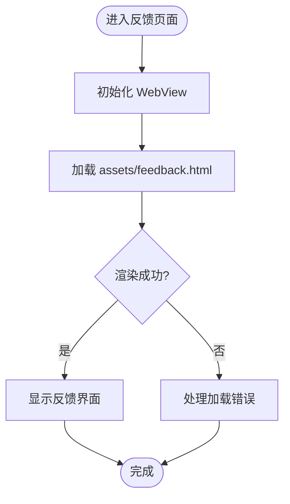
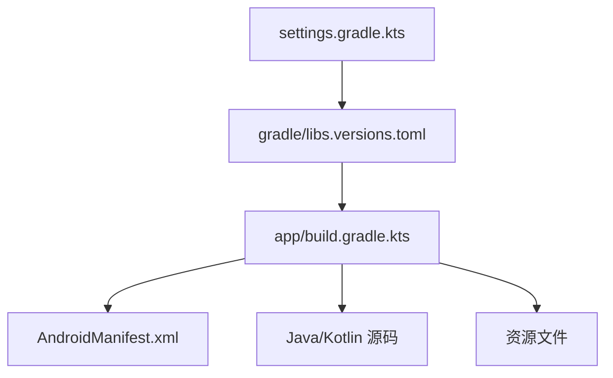

# 项目概述

<cite>
**本文引用的文件**
- [MainActivity.kt](file://app/src/main/java/com/example/demotest/MainActivity.kt)
- [FeedbackActivity.kt](file://app/src/main/java/com/example/demotest/FeedbackActivity.kt)
- [FeedbackFragment.kt](file://app/src/main/java/com/example/demotest/FeedbackFragment.kt)
- [activity_main.xml](file://app/src/main/res/layout/activity_main.xml)
- [activity_feedback.xml](file://app/src/main/res/layout/activity_feedback.xml)
- [fragment_feedback.xml](file://app/src/main/res/layout/fragment_feedback.xml)
- [feedback.html](file://app/src/main/assets/feedback.html)
- [AndroidManifest.xml](file://app/src/main/AndroidManifest.xml)
- [build.gradle.kts](file://app/build.gradle.kts)
- [gradle/libs.versions.toml](file://gradle/libs.versions.toml)
- [settings.gradle.kts](file://settings.gradle.kts)
</cite>

## 目录
1. [简介](#简介)
2. [项目结构](#项目结构)
3. [核心组件](#核心组件)
4. [架构总览](#架构总览)
5. [详细组件分析](#详细组件分析)
6. [依赖分析](#依赖分析)
7. [性能考虑](#性能考虑)
8. [故障排查指南](#故障排查指南)
9. [结论](#结论)
10. [附录：快速开始](#附录快速开始)

## 简介
DemoTest 是一个基于 Kotlin 的 Android 应用，用于演示主界面与反馈系统的集成。应用通过 Activity 作为控制器、XML 布局作为视图、assets 中的 HTML 内容作为模型数据源，采用 MVC 风格组织代码，便于初学者理解 Android 应用的常见结构与交互流程。

主要目标：
- 展示一个可运行的主界面（MainActivity）
- 提供反馈入口与反馈页面（FeedbackActivity + FeedbackFragment）
- 使用 WebView 加载本地 HTML 反馈表单或说明页
- 使用 AndroidX 库与 Gradle 构建系统管理依赖和构建流程

## 项目结构
项目采用标准 Android 工程结构，核心源码位于 app/src/main 下：
- java/com/example/demotest：包含 MainActivity、FeedbackActivity、FeedbackFragment
- res/layout：定义各页面的 XML 布局
- assets：存放静态资源，如 feedback.html
- AndroidManifest.xml：声明应用组件与权限
- build.gradle.kts：模块级构建脚本，配置依赖与插件
- gradle/libs.versions.toml：集中管理版本与依赖
- settings.gradle.kts：工程设置与模块引入

图表来源
- [MainActivity.kt:1-200](file://app/src/main/java/com/example/demotest/MainActivity.kt#L1-L200)
- [FeedbackActivity.kt:1-200](file://app/src/main/java/com/example/demotest/FeedbackActivity.kt#L1-L200)
- [FeedbackFragment.kt:1-200](file://app/src/main/java/com/example/demotest/FeedbackFragment.kt#L1-L200)
- [activity_main.xml:1-200](file://app/src/main/res/layout/activity_main.xml#L1-L200)
- [activity_feedback.xml:1-200](file://app/src/main/res/layout/activity_feedback.xml#L1-L200)
- [fragment_feedback.xml:1-200](file://app/src/main/res/layout/fragment_feedback.xml#L1-L200)
- [feedback.html:1-200](file://app/src/main/assets/feedback.html#L1-L200)

章节来源
- [AndroidManifest.xml:1-200](file://app/src/main/AndroidManifest.xml#L1-L200)
- [build.gradle.kts:1-200](file://app/build.gradle.kts#L1-L200)
- [gradle/libs.versions.toml:1-200](file://gradle/libs.versions.toml#L1-L200)
- [settings.gradle.kts:1-200](file://settings.gradle.kts#L1-L200)

## 核心组件
- MainActivity：应用入口与主界面控制器，负责导航到反馈页面
- FeedbackActivity：承载反馈页面的容器，通常嵌入 Fragment
- FeedbackFragment：实现反馈 UI 与逻辑，使用 WebView 加载本地 HTML 内容
- 布局文件：activity_main.xml、activity_feedback.xml、fragment_feedback.xml 分别对应主界面、反馈活动与反馈片段
- 静态资源：feedback.html 作为反馈模型的 HTML 内容，由 WebView 渲染

职责分工：
- Activity 层：生命周期管理与页面跳转
- Fragment 层：UI 与业务逻辑解耦，便于复用
- 视图层：XML 布局描述界面结构
- 模型层：HTML 内容作为数据源，通过 WebView 呈现

章节来源
- [MainActivity.kt:1-200](file://app/src/main/java/com/example/demotest/MainActivity.kt#L1-L200)
- [FeedbackActivity.kt:1-200](file://app/src/main/java/com/example/demotest/FeedbackActivity.kt#L1-L200)
- [FeedbackFragment.kt:1-200](file://app/src/main/java/com/example/demotest/FeedbackFragment.kt#L1-L200)
- [activity_main.xml:1-200](file://app/src/main/res/layout/activity_main.xml#L1-L200)
- [activity_feedback.xml:1-200](file://app/src/main/res/layout/activity_feedback.xml#L1-L200)
- [fragment_feedback.xml:1-200](file://app/src/main/res/layout/fragment_feedback.xml#L1-L200)
- [feedback.html:1-200](file://app/src/main/assets/feedback.html#L1-L200)

## 架构总览
本应用采用 MVC 风格的组织方式：
- 控制器（Controller）：Activity 与 Fragment 负责处理用户交互与页面流转
- 视图（View）：XML 布局定义界面元素与层级关系
- 模型（Model）：assets 中的 HTML 作为模型数据，通过 WebView 渲染

图表来源
- [MainActivity.kt:1-200](file://app/src/main/java/com/example/demotest/MainActivity.kt#L1-L200)
- [FeedbackActivity.kt:1-200](file://app/src/main/java/com/example/demotest/FeedbackActivity.kt#L1-L200)
- [FeedbackFragment.kt:1-200](file://app/src/main/java/com/example/demotest/FeedbackFragment.kt#L1-L200)
- [activity_main.xml:1-200](file://app/src/main/res/layout/activity_main.xml#L1-L200)
- [activity_feedback.xml:1-200](file://app/src/main/res/layout/activity_feedback.xml#L1-L200)
- [fragment_feedback.xml:1-200](file://app/src/main/res/layout/fragment_feedback.xml#L1-L200)
- [feedback.html:1-200](file://app/src/main/assets/feedback.html#L1-L200)

## 详细组件分析

### MainActivity 分析
- 角色：应用入口与主界面控制器
- 职责：初始化界面、响应点击事件、导航至反馈页面
- 与布局关联：绑定 activity_main.xml 中的控件
- 与导航关联：启动 FeedbackActivity

图表来源
- [MainActivity.kt:1-200](file://app/src/main/java/com/example/demotest/MainActivity.kt#L1-L200)
- [FeedbackActivity.kt:1-200](file://app/src/main/java/com/example/demotest/FeedbackActivity.kt#L1-L200)
- [activity_main.xml:1-200](file://app/src/main/res/layout/activity_main.xml#L1-L200)

章节来源
- [MainActivity.kt:1-200](file://app/src/main/java/com/example/demotest/MainActivity.kt#L1-L200)
- [activity_main.xml:1-200](file://app/src/main/res/layout/activity_main.xml#L1-L200)

### FeedbackActivity 与 FeedbackFragment 分析
- FeedbackActivity：承载反馈页面，通常作为 Fragment 的宿主
- FeedbackFragment：实现反馈 UI 与逻辑，使用 WebView 加载本地 HTML
- 与布局关联：activity_feedback.xml 与 fragment_feedback.xml
- 与模型关联：加载 assets/feedback.html

图表来源
- [FeedbackActivity.kt:1-200](file://app/src/main/java/com/example/demotest/FeedbackActivity.kt#L1-L200)
- [FeedbackFragment.kt:1-200](file://app/src/main/java/com/example/demotest/FeedbackFragment.kt#L1-L200)
- [activity_feedback.xml:1-200](file://app/src/main/res/layout/activity_feedback.xml#L1-L200)
- [fragment_feedback.xml:1-200](file://app/src/main/res/layout/fragment_feedback.xml#L1-L200)

章节来源
- [FeedbackActivity.kt:1-200](file://app/src/main/java/com/example/demotest/FeedbackActivity.kt#L1-L200)
- [FeedbackFragment.kt:1-200](file://app/src/main/java/com/example/demotest/FeedbackFragment.kt#L1-L200)
- [activity_feedback.xml:1-200](file://app/src/main/res/layout/activity_feedback.xml#L1-L200)
- [fragment_feedback.xml:1-200](file://app/src/main/res/layout/fragment_feedback.xml#L1-L200)

### WebView 加载 HTML 流程
- 在 FeedbackFragment 中初始化 WebView
- 从 assets 读取 feedback.html 并加载
- 可选：启用 JavaScript、设置安全策略等

图表来源
- [FeedbackFragment.kt:1-200](file://app/src/main/java/com/example/demotest/FeedbackFragment.kt#L1-L200)
- [feedback.html:1-200](file://app/src/main/assets/feedback.html#L1-L200)

章节来源
- [FeedbackFragment.kt:1-200](file://app/src/main/java/com/example/demotest/FeedbackFragment.kt#L1-L200)
- [feedback.html:1-200](file://app/src/main/assets/feedback.html#L1-L200)

## 依赖分析
- 构建系统：Gradle（Kotlin DSL），模块级构建脚本为 app/build.gradle.kts
- 版本管理：gradle/libs.versions.toml 集中管理 AndroidX 等依赖版本
- 工程设置：settings.gradle.kts 引入 app 模块
- 清单文件：AndroidManifest.xml 声明应用组件与必要权限

图表来源
- [settings.gradle.kts:1-200](file://settings.gradle.kts#L1-L200)
- [gradle/libs.versions.toml:1-200](file://gradle/libs.versions.toml#L1-L200)
- [build.gradle.kts:1-200](file://app/build.gradle.kts#L1-L200)
- [AndroidManifest.xml:1-200](file://app/src/main/AndroidManifest.xml#L1-L200)

章节来源
- [build.gradle.kts:1-200](file://app/build.gradle.kts#L1-L200)
- [gradle/libs.versions.toml:1-200](file://gradle/libs.versions.toml#L1-L200)
- [settings.gradle.kts:1-200](file://settings.gradle.kts#L1-L200)
- [AndroidManifest.xml:1-200](file://app/src/main/AndroidManifest.xml#L1-L200)

## 性能考虑
- WebView 优化：避免在主线程执行重任务；按需启用 JavaScript；合理设置缓存策略
- 资源加载：确保 feedback.html 体积适中，必要时进行压缩或拆分
- 内存管理：在 Fragment 销毁时释放 WebView 相关资源，防止内存泄漏
- 构建优化：合理使用依赖版本，减少冗余库；开启 ProGuard/R8 混淆与裁剪

[本节为通用指导，不直接分析具体文件]

## 故障排查指南
常见问题与定位思路：
- 页面无法显示：检查 AndroidManifest.xml 是否注册了 Activity；确认布局文件路径正确
- WebView 空白：确认 assets/feedback.html 存在且可读；检查 Fragment 是否正确加载 HTML
- 崩溃或异常：查看日志输出，定位空指针或权限问题；核对依赖版本兼容性
- 构建失败：检查 gradle/libs.versions.toml 与 app/build.gradle.kts 的依赖声明是否一致

章节来源
- [AndroidManifest.xml:1-200](file://app/src/main/AndroidManifest.xml#L1-L200)
- [FeedbackFragment.kt:1-200](file://app/src/main/java/com/example/demotest/FeedbackFragment.kt#L1-L200)
- [feedback.html:1-200](file://app/src/main/assets/feedback.html#L1-L200)
- [build.gradle.kts:1-200](file://app/build.gradle.kts#L1-L200)
- [gradle/libs.versions.toml:1-200](file://gradle/libs.versions.toml#L1-L200)

## 结论
DemoTest 以简洁的结构展示了 Android 应用中常见的 MVC 组织方式与 WebView 的使用场景。通过 MainActivity 与 FeedbackActivity/Fragment 的配合，结合 XML 布局与本地 HTML 模型，开发者可以快速上手并扩展更多功能。建议在实际项目中关注性能与可维护性，持续优化资源与依赖管理。

[本节为总结性内容，不直接分析具体文件]

## 附录：快速开始
- 环境准备：安装 Android Studio 与 JDK，克隆或打开项目
- 同步依赖：打开 settings.gradle.kts 与 gradle/libs.versions.toml，确保依赖版本可用
- 运行应用：选择设备或模拟器，运行 app 模块
- 基本操作：在主界面点击反馈按钮进入反馈页面，WebView 将加载 feedback.html

章节来源
- [settings.gradle.kts:1-200](file://settings.gradle.kts#L1-L200)
- [gradle/libs.versions.toml:1-200](file://gradle/libs.versions.toml#L1-L200)
- [build.gradle.kts:1-200](file://app/build.gradle.kts#L1-L200)
- [MainActivity.kt:1-200](file://app/src/main/java/com/example/demotest/MainActivity.kt#L1-L200)
- [FeedbackActivity.kt:1-200](file://app/src/main/java/com/example/demotest/FeedbackActivity.kt#L1-L200)
- [FeedbackFragment.kt:1-200](file://app/src/main/java/com/example/demotest/FeedbackFragment.kt#L1-L200)
- [feedback.html:1-200](file://app/src/main/assets/feedback.html#L1-L200)